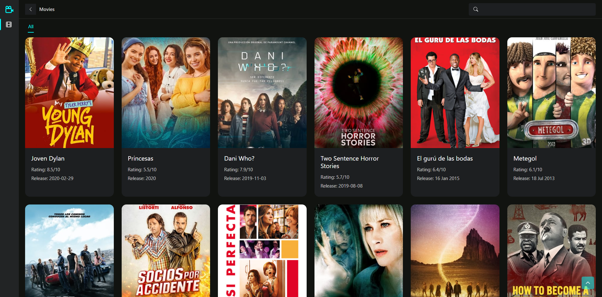

<p float="left">
  
  
  
  
  
  
  
  
  
  
  
</p>

## Movie Search App

#### What is Movie Search App?

Movie Search App is an app where you can search from all movies and get their info like genre, release, short description etc.

#### Demo link: https://mhs-dev.netlify.app/

## Project Screen Shot(s)

#### Example:   


## Installation and Setup Instructions

#### Example:  

Clone down this repository. You will need `node`, `npm` and `Docker` installed globally on your machine. Docker is needed to setup development process with ease.  

Installation:

### Frontend

```
cd web
npm install
```   

To Start Server:

`npm start` - Docker will handle this for you.

To Visit App:

```
http://localhost:3000
```  


### Backend

```
cd server
npm install
```  

To Start Server:

`npm run serve` - Docker will handle this for you.  

Apis will be available at 8000 port if not provided in .env file


```
http://localhost:8000
```

### Update `.env` for the web
```
NEXT_PUBLIC_API_URI="http://localhost:8000"
```

### Update `.env` for the server
```
RAPIDAPI_KEY="your rapid api key"
RAPIDAPI_HOST="your rapid api host"
SERVER_URI="http://localhost:8000"
```

## Reflection

  - This project was built, so that i could learn elasticsearch and apply that on a real world project.
  - Learned about cron job. I have used this to get all movies from rapid api and store them in elasticsearch if not exist in every month. 
